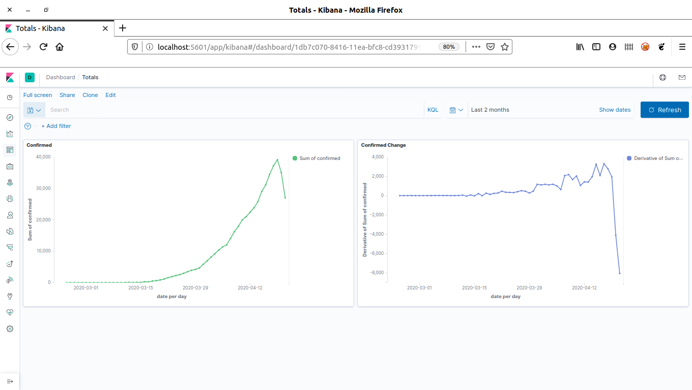
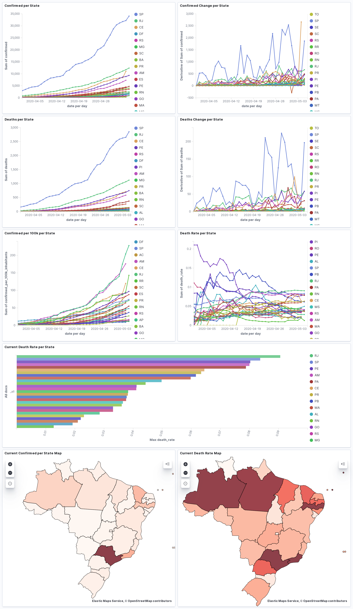

# es-covid19-br

Empacota os dados de [turicas/covid19-br](https://github.com/turicas/covid19-br) em uma instância Kibana/Elasticsearch,
facilitando acesso e consulta.

## Dependências

Você irá precisar de:
 - node v10+
 - npm
 - python 3+
 - curl
 - sudo

```
$ make setup
```

Isto deve dar conta de instalar todas as ferramentas adicionais necessárias.

Este projeto foi apenas testado em Linux, e precisa de uma configuração de sistema
para que o Elasticsearch rode corretamente sobre Docker. Esta config talvez não seja
necessária para outros ambientes, mas é preciso testar e adequar o Makefile para que
funcionem neles.

## Usando

Após o setup inicial, você pode:

```
$ make run
```

Isto irá fazer o download dos dados usando os scripts e imagens no repo
[turicas/covid19-br](https://github.com/turicas/covid19-br). Este passo pode
levar por volta de 30min (ou mais, dependendo de sua conexão), seja paciente.

Em seguida, serão inicializados containeres Elasticsearch e Kibana, sendo os dados
populados em índices do Elasticsearch logo em seguida.

Terminada a inclusão dos dados no Elasticsearch, você pode importar alguns dashboards,
visualizações e queries que vêm junto com o repositório com:

```
$ make import-kibana
```

E, finalmente, acessar o Kibana: http://localhost:5601




## Atualizando os dados

Caso você queira atualizar os dados com a ultima versão disponível, você poderia executar:

```
$ make recollect-data
```

Mas note que isto irá também resetar as configurações de objetos salvos no Kibana,
ou seja, dashboards, queries, visualizações, etc.

Para que você não perca seus dashboards e queries, incluimos os seguintes comandos:

```
$ make export-kibana
$ make recollect-data
... (espere os downloads terminarem e os dados terem sido corretamente repopulados no Elasticsearch)
$ make import-kibana
```

Recarregue o Kibana, caso o tenha aberto no browser (full reload), para que as alterações façam efeito.

Se você alterou algo relacionado a configuração de templates ou pipelines, ou mesmo dados (veja seção abaixo),
e deseja que elas tenham efeito sem precisar executar a coleta de dados novamente, basta rodar:

```
$ make export-kibana
$ make reload-data
$ make import-kibana
```

E recarregar a aplicação no browser da mesma forma.

## Configurando

A injestão dos dados é feita no Elasticsearch em um índice por arquivo .csv gerado pelo projeto de coleta (covid19-br).
Para um dado arquivo `nome.csv` é criado um índice chamado `nome` no Elasticsearch. Para que as queries e dashboards funcionem bem, é preciso
prover _mappings_ para que os dados sejam interpretados corretamente pelo Elasticsearch. Um mapping de exemplo para o arquivo/índice
de casos (`caso.csv`/`caso`) é incluído no diretório `index-templates`, com o nome `caso.json`. Outros templates com os mappings necessários
podem ser incluídos neste diretório, seguindo a convenção `nome.json`, onde `nome` é o nome do índice/arquivo .csv.

Pode ser também necessária a customização do pipeline ou dos filtros usados pelo logstash usado na ingestão dos dados.
Esta configuração se encontra no arquivo `logstash/logstash.conf`

## Contribuindo

Contribuições de código podem ser feitas via PR normalmente.

Caso deseje incluir ou modificar algum dashboard, query, visualização ou qualquer
dado relacionado ao Kibana, localize ou crie um diretório adequado para sua alteração
no diretório `saved-objects`. E envie um PR.

No PR, descreva a motivação e a alteração na maior quantidade de detalhes possível.

Você pode querer revisar as Issues que temos abertas.
